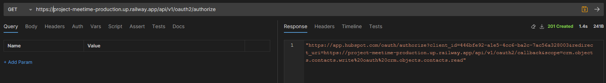
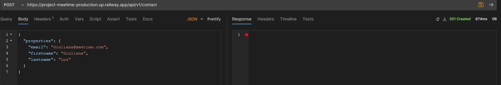
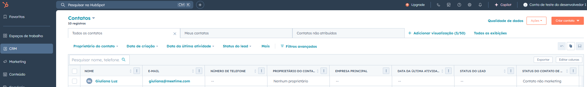
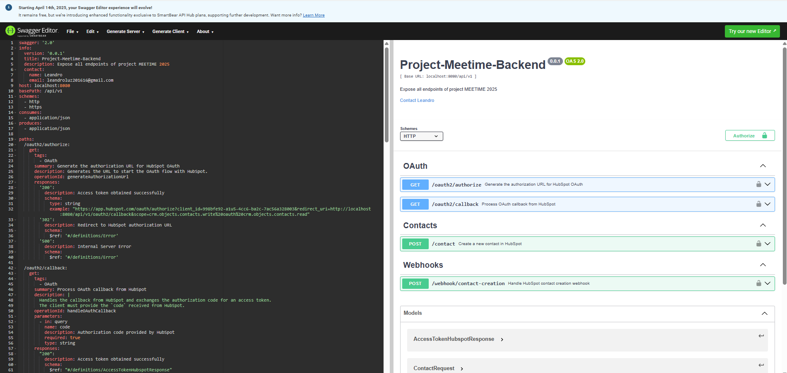
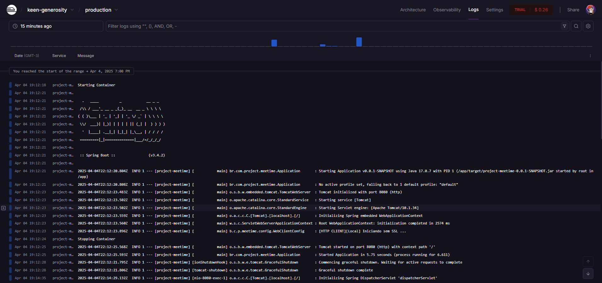
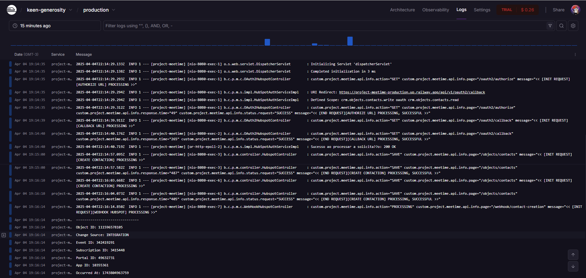
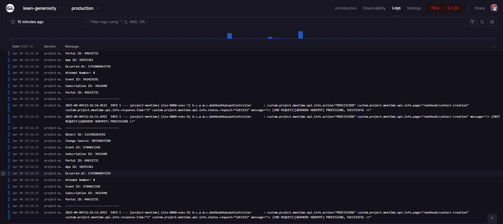

# Caso queiram testar com minha API na RAILWAY:
## Se estiver ativa ainda no free tier ```https://project-meetime-production.up.railway.app```
# 📊 Project-Meetime-Backend

Integração reativa com a API do **HubSpot CRM**, construída com **Java + Spring Boot + WebClient**, que permite:

✅ Autenticação via OAuth 2.0  
✅ Criação de contatos na plataforma HubSpot  
✅ Recebimento de eventos via Webhooks (ex: contato criado)

---

## 🚀 Como usar a aplicação

### 1. Faça um Fork do repositório

> Repositório oficial:  
👉 [https://github.com/leandroleiteh/project-meetime](https://github.com/leandroleiteh/project-meetime)

Clique em **Fork** no topo da página para criar sua própria cópia.

---

### 2. Crie uma conta gratuita no Railway

Acesse: [https://railway.app](https://railway.app)
- Faça login com GitHub
- Crie um novo projeto
- Clique em **Deploy from GitHub Repo**
- Escolha o fork que você criou (`project-meetime`)
- Railway irá automaticamente identificar o projeto como uma aplicação Java e iniciar o deploy.

---

### 3. Configure variáveis de ambiente

Clique na aba **Variables** no projeto Railway e adicione:

| Chave                   | Valor                                                                                  |
|------------------------|----------------------------------------------------------------------------------------|
| `HUBSPOT_CLIENT_ID`    | (sua client id do app criado no HubSpot)   **OBTERÁ POS CONTA NA HUBSPOT**                 |
| `HUBSPOT_CLIENT_SECRET`| (sua client secret do app criado no HubSpot) **OBTERÁ POS CONTA NA HUBSPOT**               |
| `HUBSPOT_REDIRECT_URI` | `https://<SEU_DOMINIO>.railway.app/api/v1/oauth2/callback` **CRIARÁ POS CONTA NA HUBSPOT** |
| `HUBSPOT_SCOPE`        | `crm.objects.contacts.write oauth crm.objects.contacts.read`                           |

> ❗ Esses valores **não são os do exemplo acima**, você deve usar os gerados na sua conta HubSpot.

---

### 4. Crie um App no HubSpot

1. Acesse: [https://developers.hubspot.com](https://developers.hubspot.com)
2. Crie uma **conta de desenvolvedor gratuita**
3. Crie um **novo app**:
    - Vá em **Apps**
    - Clique em **Create app**
    - Configure os **Redirect URIs** com a URL pública do Railway (ex: `https://meetime-app.up.railway.app/api/v1/oauth2/callback`)
4. Copie o `client_id` e `client_secret`
5. Registre escopos:
    - `crm.objects.contacts.read`
    - `crm.objects.contacts.write`
    - `oauth`
6. Crie uma conta **sandbox/test** associada ao app
7. **Habilite webhooks** e registre o evento `contact.creation` com a URL:  
   `https://<SEU_DOMINIO>.railway.app/api/v1/webhook/contact-creation`

---

### 5. Acesse os endpoints

**Base URL (Railway):**  
`https://<seu_projeto>.railway.app/api/v1`

---

## 💻 Rodando Localmente

Você também pode executar a aplicação localmente (exceto o Webhook):

### Pré-requisitos:
- Java 17+
- Maven
- Necessário cumprir os passos de criar as contas e configurações na HubSpot

### Passos:

```bash
git clone https://github.com/leandroleiteh/project-meetime.git
cd project-meetime
``` 
### 🔧 Configurar `application.properties` local:

Crie ou edite o arquivo `src/main/resources/application.properties` com as seguintes propriedades:

```properties
# Hubspot
hubspot.client-id=SEU_CLIENT_ID
hubspot.client-secret=SEU_CLIENT_SECRET
hubspot.redirect-uri=http://localhost:8080/api/v1/oauth2/callback
hubspot.scope=crm.objects.contacts.write oauth crm.objects.contacts.read
```
### ⚠️ Atenção: o Webhook não funciona localmente, pois exige HTTPS.
**Para testes locais, você pode utilizar ferramentas como ngrok.**

#### Execute a aplicação da maneira que preferir. IDE ou linha de comando : ```./mvnw spring-boot:run```

---

## 🔐 Autenticação OAuth2

### 🔁 Iniciar fluxo de autenticação

**Endpoint:**
```
GET /api/v1/oauth2/authorize
```

**Descrição:**
Devolve a URL completa para autenticação junto com callback.



---

### 🎯 Callback OAuth2

**Endpoint:**
```
GET /api/v1/oauth2/callback?code={authorization_code}
```

**Descrição:**
Após se autenticar, recebe o `authorization_code` do HubSpot e troca por um `access_token`.

*Lembrando, quando receber o response do método ```/api/v1/oauth2/authorize```, basta usar o mesmo para se autenticar e automaticamente ele retorna neste endpoint de callback fazendo a troca pelo "access_token"

**Exemplo de resposta:**
```json
{
  "access_token": "eyJhbGciOiJIUzI1...",
  "token_type": "Bearer",
  "expires_in": 3600
}
```

---

## 👤 Criar contato

**Endpoint:**
```
POST /api/v1/contact
```

**Headers:**
```http
token: {access_token} (apenas o token)
Content-Type: application/json
```

**Payload:**
```json
{
  "properties": {
    "firstname": "John",
    "lastname": "Doe",
    "email": "johndoe@example.com"
  }
}
```



**Respostas:**

- `201 Created` – Contato criado com sucesso
- `400 Bad Request` – Dados inválidos
- `401 Unauthorized` – Token inválido ou ausente
- `429 Too Many Requests` – Limite de requisições excedido

---

## 📩 Webhooks – Criação de contato

**Endpoint:**
```
POST /api/v1/webhook/contact-creation
```

**Headers (opcional):**
```
X-HubSpot-Signature: {assinatura}
X-HubSpot-Signature-Version: v1
Content-Type: application/json
```

**Payload:**
```json
[
  {
    "objectId": 123456789,
    "changeSource": "CRM",
    "eventId": 987654321,
    "subscriptionId": 111111,
    "portalId": 222222,
    "appId": 333333,
    "occurredAt": 1687909200000,
    "attemptNumber": 1,
    "subscriptionType": "contact.creation",
    "changeFlag": "NEW",
    "sourceId": "contact"
  }
]
```

**Resposta esperada:** `200 OK`

---

## 📄 Swagger

Para visualização do swagger, basta copiar o conteúdo deste arquivo ```src/main/resources/endpoints/swagger_code_gen_project_meetime_backend.yaml``` e acessar o ```https://editor.swagger.io/```
colando o contúdo, onde terá toda visão dos objetos e contratos de endpoints.

### Exemplo: 


---
## Exemplo em funcionamento com os logs do container hospedado na plataforma  ```https://railway.com```




Como foi apresentado acima, foram criados logs específicos no controller para acompanhamento de todos endpoints e requests.

---

## 📦 Dependências utilizadas no projeto `project-meetime`

### 🧰 Spring Boot

- **spring-boot-starter-web**  
  Fornece suporte para construção de aplicações web com Spring MVC, incluindo REST APIs.

- **spring-boot-starter-webflux**  
  Permite o uso de programação reativa com WebClient e Flux/Mono.

- **spring-boot-devtools**  
  Habilita o *hot reload* durante o desenvolvimento, facilitando a atualização automática da aplicação ao salvar arquivos.

- **spring-boot-starter-test**  
  Contém bibliotecas para testes, como JUnit, Mockito e Spring Test. (Não usei)

---

### ⚙️ Swagger/OpenAPI

- **swagger-core**  
  Núcleo da biblioteca Swagger 2.x, usado para geração de documentação de APIs.

- **swagger-annotations**  
  Permite anotar os endpoints com informações que alimentam a documentação Swagger.

- **swagger-codegen-maven-plugin**  
  Gera código automaticamente a partir de arquivos OpenAPI/Swagger YAML/JSON.

---

### 🔄 Reatividade

- **reactor-test**  
  Utilitário para testes de streams reativos usando `StepVerifier`. (Não usei)

---

### 🛠 Utilitários

- **lombok**  
  Reduz boilerplate com anotações como `@Getter`, `@Setter`, `@Builder`, etc.

- **jackson-databind-nullable**  
  Suporte a campos opcionais com `JsonNullable`, usado em APIs geradas via OpenAPI.

- **commons-lang**  
  Utilitários adicionais para manipulação de strings, objetos, números, datas, etc.

- **commons-collections**  
  Conjuntos de coleções estendidas, como mapas bidirecionais, listas fixas, etc.

- **commons-codec**  
  Suporte a algoritmos de codificação/decodificação como Base64, SHA, MD5.

- **mapstruct / mapstruct-processor**  
  Framework para mapeamento automático entre DTOs e entidades (geração em tempo de compilação).

---

### 🌐 Servlet e Anotações - necessárias para geração de classes.

- **jakarta.servlet-api**  
  Interface da especificação Servlet 6.0 — 

- **javax.servlet-api**  
  Interface da especificação Servlet 4.0 — 

- **javax.annotation-api**  

---

### 🔐 Segurança

- **owasp.encoder**  
  Utilitário para encoding seguro de dados, ajudando a prevenir ataques como XSS.

---

## 🛠️ Plugins do Maven

- **swagger-codegen-maven-plugin**  
  Automatiza a geração de modelos e interfaces a partir da especificação Swagger YAML.

- **build-helper-maven-plugin**  
  Adiciona diretórios de código-fonte gerado ao classpath de compilação do Maven.

- **spring-boot-maven-plugin**  
  Empacota a aplicação como um arquivo `.jar` executável com todas as dependências (fat JAR).

---

gpt foi usado para ajuda na criação da doc